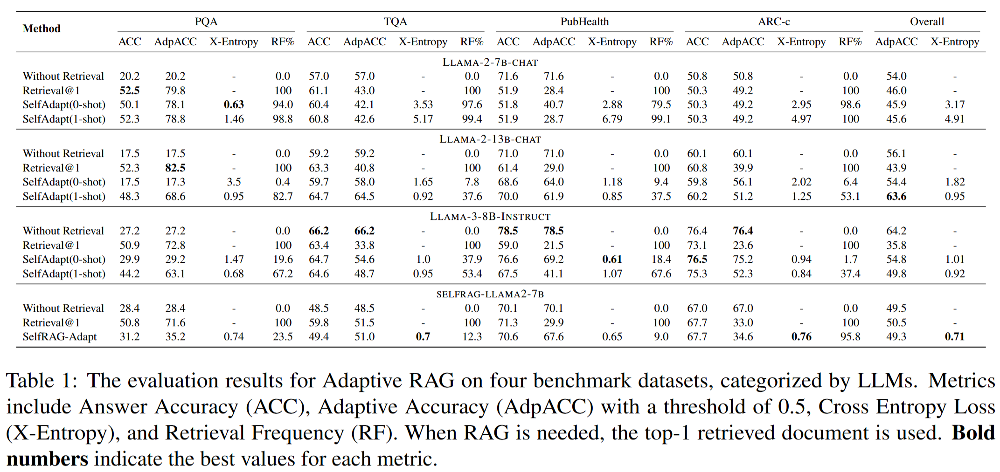
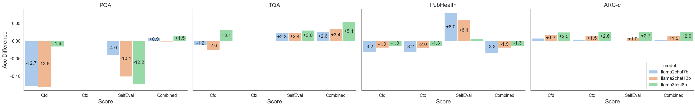

# Adaptive RAG Guided by Self-Evaluation
## Intro

We prompt an LLM: "Are you capable of answering the question {q} on your own, or do you need external knowledge as support?"

We format this as a **yes/no evaluation question** and observe the predicted probabilities, P(‘yes’| eval instruction) and P(‘no’| eval instruction), to gauge the model's **confidence** in its ability to handle the question independently. (Here, ‘yes’ and ‘no’ are encoded as single-token labels.) [1]

Next, we examine the model's token-level calibration on this self-evaluation task: Does its accuracy in answering questions aligns with its confidence levels as indicated in the self-evaluation?

Ultimately, this research aims to explore **an LLM’s awareness of its knowledge boundary**. “Do you know what you know?”, and more trickly, “Are you aware of what you do not know?” [2]

In this starting stage, we narrow the ambitious research goal into a small domain: its applicability in adaptive RAG.

Additionally, we aim to detect possible post-generation indicators that can reflect an LLM’s answer accuracy. That is, given a question q, some context about the question c, the LLM answer a, and the output token probabilities  $\mathbf{p}_t = [p_1, p_2, …, p_N]_t$, can we find some quantitative metrics out of them to help us foresee the answer accuracy to the question without checking the ground truth answer.

The candidate metrics are:

1. **Average Token-level Probability (↑):**
      
    $\frac{1}{T}\sum\limits_{t=1}^{T}\log(\max(\mathbf{p}_t))$
      
    **Reasoning:** A higher token-level probability means the model is more certain about its prediction and, thus less likely to give non-factual output [3].
    
    Consider two cases:
    
    - The capital of the United Kingdom is ___.
    - John Smith is a ___.
    
    In the first case, the completion is well-known, and the model should have learned this knowledge. This serves as a positive example, supporting that higher certainty should correlate with higher accuracy.
    
    In contrast, in the second case, "John Smith is a ___," the model might encounter ambiguity, as "John Smith" could be associated with multiple roles or professions. This scenario is a negative example where the model is uncertain about the continuation, leading to a flat probability distribution. During inference, this is likely to lead to a non-factual word being generated.
      
2. **The NLI (Natural Language Inference) scores from a standalone NLI model (↑):**
      

    1. NLI(q, c)
    2. NLI(q, a)
    3. NLI(c, a)
      

    **Reasoning:** Natural Language Inference (NLI) determines whether a hypothesis follows a premise, classified into either entailment/neutral/contradiction [4]. 
    
    The NLI score reflects the coherency and logical connection between two sentences.
    
    For example, 
    
    NLI(q, c) can potentially reveal how well the context supports the question.
    
    NLI(q, a) can reveal if the answer logically follows from the question.
    
    NLI(c, a) can reveal if the answer has effectively exploited the context. 
        
3. **Context Relevance Score (↑):**
      
    $s(q,c) = 〈f_\theta(q),f_\theta(c)〉$[5]

    where $f_\theta$ is a retriever model parameterized by $\theta$.
      

    **Reasoning:** The intuition is simple here, a higher relevance score of a retrieved document (context) c to the question q, indicates the context is likely to be more helpful for the LLM to make an accurate response.
    

## **Datasets:**

We use the following datasets for experiments:

**TriviaQA-test:** Open-domain QA pairs.

**PopQA-longtail-test:** Open-domain QA pairs. This dataset deliberately collected less popular Wikipedia entities. [6]

**ARC-c-test:** science multiple choices, a model chooses from options A, B, C, D.

**PubHealth:** Fact-checking Public Health claims, a model should judge true or false.

## Models

We chose three open-source models from the Llama family. They either differ in size or architecture.

1. Llama2-7B-chat
2. Llama2-13B-chat
3. Llama3-8B-instruct

These are all instruction-following finetuned models. We use them as candidate models and explore their self-evaluation capabilities and calibration accuracy.

Due to computation limits, some experiments were only done using Llama2-7B-chat and Llama3-8B-instruct.

We also included [SelfRAG-Llama7B](https://huggingface.co/selfrag/selfrag_llama2_7b), a finetuned LM that incorporates self-evaluation as special tokens.

We use [contriever-msmarco](https://github.com/facebookresearch/contriever) as the document retriever. 

We use the [mDeBERTa-v3-base-xnli-multilingual-nli-2mil7](https://huggingface.co/MoritzLaurer/mDeBERTa-v3-base-xnli-multilingual-nli-2mil7) NLI model.

## Findings:

### **How good is the models’ self-evaluation calibration?**

Here, we use the metric: calibration AUC [2]**.** It reflects the models’ calibration accuracy on the evaluation of whether they think they can answer a question correctly.

It is simply defined as

True Positive: they think they can handle a question (self-evaluation), and they turn out to answer it correctly (performance).

False Positive: they think they can handle a question (self-evaluation), but they fail.

We quantify an LLM’s self-evaluation of its confidence to answer a question correctly using the formula:

`P('[yes]'| eval instruction) / (P('[yes]'| eval instruction) + P('[no]'| eval instruction))`.

For SelfRAG-Llama7B, we use the model’s special tokens:

`P('[No Retrieval]'| eval instruction) / (P('[No Retrieval]'| eval instruction) + P('[Retrieval'| eval instruction))`.

**We refer to this measure as self-eval confidence.**

The TL;DR conclusion is that models' self-evaluation calibration varies across datasets. In other words, **no model consistently excels at judging its ability to handle a question. However, scaling, better architecture, and specific-finetuning encourage calibration accuracy.**

In Figure 1, Llama2-7B consistently shows low confidence, while its larger counterpart, Llama2-13B, is overly confident (which aligns with the findings in the concurrent work [7]). Meanwhile, the fine-tuned SelfRAG-7B displays more moderate judgments, with its probabilities clustering around the midpoint—a sign of poor calibration rather than balanced confidence. Llama3-8B is more selective, which is desirable, except in science-related questions (ARC-c). 

**Figure 1**

Figure 2 illustrates the calibration accuracy of the models, quantified using calibration-AUC.

PQA is a particularly challenging dataset because it intentionally pairs well-known subjects with obscure entities in the knowledge graph. This setup often leads models to overestimate their confidence in providing correct answers. Llama2-7B achieves a high calibration-AUC on this dataset, largely due to its generally low confidence. For the other datasets, a consistent performance hierarchy emerges: SelfRAG-7B > Llama3-8B > Llama2-13B. SelfRAG-7B has the best calibration on the remaining three datasets, while Llama3-8B remains competitive, particularly for PubHealth and the overall AUC score.

**Figure 2**

### Use model self-evaluation for selective RAG

The self-eval confidence **in this RAG application context serves as the retrieval probability.** This proportional measure guides our decision on whether to use RAG. If it’s too low, we perform RAG on the question, if not, we let the model handle the question by itself.

As shown in Table 1, the proposed selective retrieval generally fails to outperform traditional retrieval methods on QA datasets, particularly on PQA across Llama2-13B, Llama3-8B, and SelfRAG-7B.

However, it effectively mitigates the negative impacts of RAG. When the model performs better without retrieval but worse with RAG, selective retrieval can prevent RAG failures and maintain accuracy comparable to the non-retrieval approach.

This improvement is evident on PubHealth and ARC-c for Llama2-13B and Llama3-8B. However, we do not observe the same effect for the fine-tuned SelfRAG-7B, as seen in the ARC-c results.

### An Off-Path Investigation: Model Answer Accuracy Indicator without Ground Truth

Selective retrieval does not work well generally. We followed SELFCHECKGPT’s work [3] in examining other potential indicators to predict model factuality.

If an indicator can be allocated, then a selective RAG process can still be established.

We evaluate the token-level probability, the NLI scores, and the context score, and try to regress a relationship between the candidate indicators and model accuracy on the fact-demanding datasets.

**Token-level Probability as an Indicator**

Token-level probability has been widely proposed as a good measure of model factuality in many studies [3, 8, 9]. According to our experiments, this holds true.

Prediction token-level probability is highly correlated with accuracy in open-domain question answering.

However, for questions requiring a strict answer format, like closed-domain multiple choice or fact-checking, the correlation is less clear. Here, the question format already encourages answer convergence, so the model may still assign high probability to incorrect answers.

Despite this, token-level probability remains a strong indicator for open-domain QAs, as reflected in our results. 

**NLI Scores as an Indicator**

No clear correlation between answer accuracy and the NLI scores for question-answer, question-context, or context-answer pairs. We used mDeBERTa-v3-base for NLI, while SELFCHECKGPT fine-tuned an NLI model for their LLM benchmarking purpose. I don’t think fine-tuning an NLI model for selective RAG is a good idea when it comes to generalizability. 

**Context Relevance Score as an Indicator:**

Context relevancy is another strong candidate for estimating answer accuracy, but it only applies in RAG scenarios.

It’s particularly useful when the dataset is challenging, like PopQA. For ARC-c, we expect low or even anti-correlation because Llama3-8B performs best without retrieval. This pattern doesn’t hold for PubHealth, but we do see a high confidence interval on both ARC-c and PubHealth—datasets that don’t favor retrieval. This high confidence interval could also be due to sparse points in certain areas, like the upper tail for ARC-c and PubHealth, indicating that the retriever struggles to produce high-similarity context.

In any case, when using RAG, it's always a good idea to check the quality of retrieved context and filter out low-quality ones by examining the relevancy score before adding them in the prompt.

**Ablation Study**

Setup: Retrieve top 5 relevant documents and generate five candidate responses, select the response with the best metric score  as final output.

Metric Indicators:

 - Confidence (Cfd): average token probabilities.
 - Context Relevance (Ctx): context relevance score.
 - Self-evaluation (SelfEval): ask the same LLM to choose top answer, i.e., answer a single token in `["1", "2", "3", "4", "5"]`. 
 - Combined: sum of the three scores above, for self-evaluation scores, use softmaxed token probabilities of `"1", "2", "3", "4", "5"`. All three metric scores are normalized to [0, 1] before sum.

Accuracy losses and gains using RAG guided by factuality estimation metrics compared to retrieval@5:

## (Not) Final Words

This repository presents the interim results of our research on improving LLM factuality and reducing hallucinations. Current progress remains far from my ultimate research goal: to explore and strengthen the LLM’s ability to recognize its knowledge boundaries and provide feedback on the factuality of its responses, thereby ensuring a more trustworthy, evidence-based, and transparent AI.

The code in this repository is not yet optimized for reproduction. If you’re interested in this work or potential collaboration, please feel free to reach out via DM [me](zcabhub@ucl.ac.uk).

## Reference

[1] [[2207.05221] Language Models (Mostly) Know What They Know](https://arxiv.org/abs/2207.05221)

[2] [[2312.09300] Self-Evaluation Improves Selective Generation in Large Language Models](https://arxiv.org/abs/2312.09300)

[3] [[2303.08896] SelfCheckGPT: Zero-Resource Black-Box Hallucination Detection for Generative Large Language Models](https://arxiv.org/abs/2303.08896)

[4] [[2310.01558] Making Retrieval-Augmented Language Models Robust to Irrelevant Context](https://arxiv.org/abs/2310.01558)

[5] [[2112.09118] Unsupervised Dense Information Retrieval with Contrastive Learning](https://arxiv.org/abs/2112.09118)

[6] [[2212.10511] When Not to Trust Language Models: Investigating Effectiveness of Parametric and Non-Parametric Memories](https://arxiv.org/abs/2212.10511)

[7] [[2402.11457] When Do LLMs Need Retrieval Augmentation? Mitigating LLMs' Overconfidence Helps Retrieval Augmentation](https://arxiv.org/abs/2402.11457)

[8] [[2404.10198] ClashEval: Quantifying the tug-of-war between an LLM's internal prior and external evidence](https://arxiv.org/abs/2404.10198)

[9] [[2405.14734] SimPO: Simple Preference Optimization with a Reference-Free Reward](https://arxiv.org/abs/2405.14734)